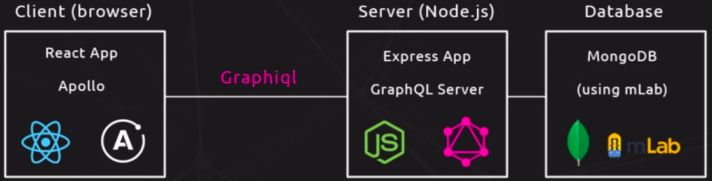

# Tech stack


# Express backend
Install modules
```
npm i express graphql express-graphql lodash
```
1. ```graphql```: to define graph and get GraphQL data types
2. ```express-graphql```: To create express endpoint. By convention it's named as ```qraphqlHTTP```
```js
const graphqlHTTP = require('express-graphql')
```
3. ```lodash```: Utility library. Used to find item from array


## GraphQL schema
It performs 3 tasks
1. Define object types: Eg. ```BookType```
2. Define relation between object types
3. Define **root query**: Root query specifies how user can query data.

# Querying
Enable **graphiql** GUI for graphql
```js
app.use('/graphql', graphqlHTTP({

    graphiql: true //start graphiql GUI on localhost:4000/graphql
}))
```

1. Find book with id: 1
```graphql
{
    book(id: 1){
        name
        genre
    }
}
```
2. Find author with id: 1
```
{
    author(id: 1){
        name
        age
    }
}
```

# Relations
We can create a relationship between 2 GraphQL types by nesting them:
```js
const BookType = new GraphQLObjectType({
    name: 'Book',
    fields: () => ({
        id: { type: GraphQLID },
        name: { type: GraphQLString },
        genre: { type: GraphQLString },
        author: {
            type: AuthorType,
            resolve(parent, args){
                return _.find(authors, {id: parent.authorId})
                //compare id in authors[] with authorId in books[]
            }
        }
    })
})
```
Here we can query about a book's author by nesting 'AuthorType' in 'BookType'
```graphql
{
    book(id: 2){
        id
        name
        genre
        author{
            name
            age
        }
    }
}
```